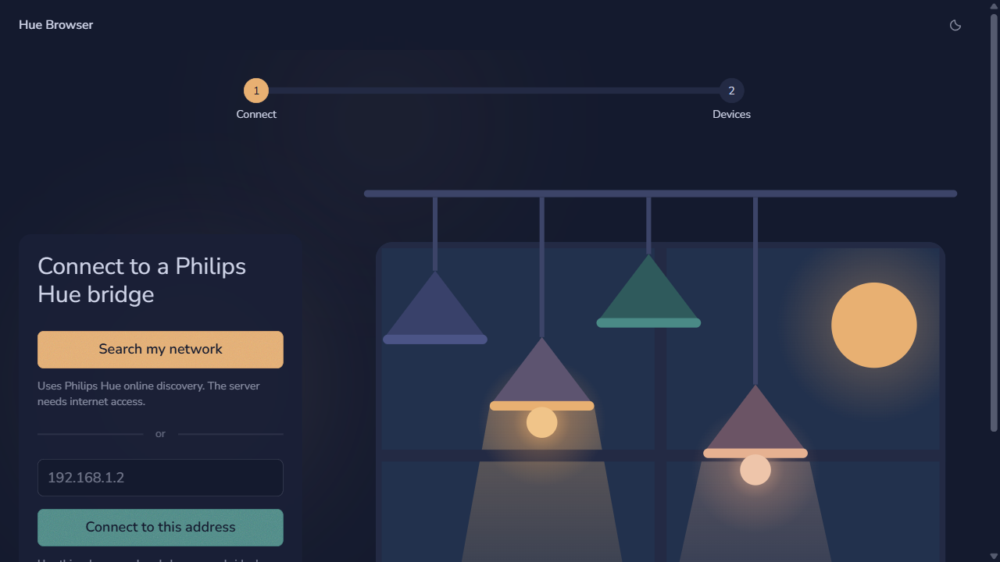
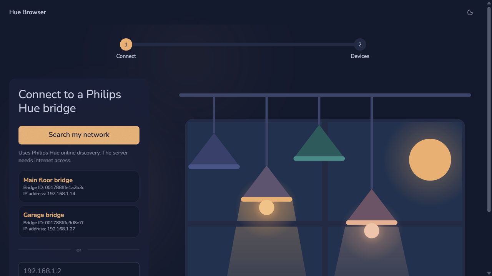
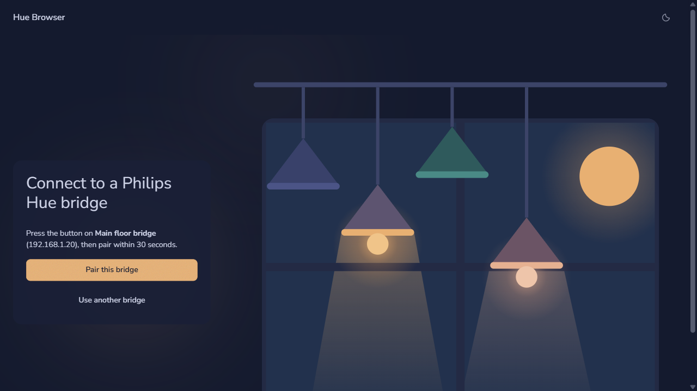

You can search for a Philips Hue bridge on the local network, ask Philips Hue online discovery, or enter its local IP address yourself. In each case, the computer running Hue Browser must be able to reach the bridge over your home network, including when Hue Browser runs in Docker. Pairing requires a physical press of the button on the bridge.

## Search for bridges

**Search my network** tries local mDNS discovery and Philips Hue online discovery in the same search. Local mDNS works without internet access when the computer or container can send multicast DNS queries to UDP port 5353 and receive bridge responses; Philips Hue online discovery needs internet access.

1. Select **Search my network**. Each discovered card shows a bridge ID and local IP address right away.
2. Wait for the indicator beside each IP address while Hue Browser checks that bridge over secure local HTTPS. If it responds, its name appears in the card and you can select it.
3. Select the bridge you want to pair. If a card says **Name unavailable** and shows an error, try the address shown on that card using the manual method below.

Either discovery method may return no bridges even when a bridge is on your network, and a failure from one method does not hide bridges found by the other. If Philips Hue online discovery is rate-limited and provides a wait time, Hue Browser displays it; otherwise you can wait before searching again or use the manual method. An HTTP 520 response shows a wait time only if the service provides one; 520 alone does not establish that you were rate-limited. A name lookup may also fail when the computer running Hue Browser cannot reach the bridge locally.

## Allow local discovery

Local mDNS discovery depends on multicast support between the server running Hue Browser and the Philips Hue bridge. Docker's default bridged network commonly does not forward multicast DNS from the home network into the container, so the search can still rely on Philips Hue online discovery or manual entry unless you opt in to a network mode that carries multicast.

- On Linux Docker hosts, run Hue Browser with host networking when you want local mDNS discovery inside the container: `docker run --rm --network host ghcr.io/seesharprun/hue-browser:latest`.
- On Docker Desktop for Windows, enable host networking in Docker Desktop when available, or run the development server directly on Windows and allow Node.js through Windows Defender Firewall on private networks.
- On any platform, keep manual IPv4 entry available for networks that block multicast or isolate wired, wireless, guest, or container traffic.

## Enter an IP address

Manual entry works without local mDNS or the Philips Hue online discovery service. Find the bridge's local IPv4 address in your router or Philips Hue setup, then use the address field under **or**.

1. Type the address, such as `192.168.1.2`, in **Bridge address**. Enter only the address, without `https://` or a port number.
2. Select **Connect to this address**. Hue Browser checks the bridge's identity over secure local HTTPS and shows its name and address before pairing.

If the check fails, confirm that the address belongs to the bridge and that the computer or container running Hue Browser can reach it. A certificate error may mean the address points to another device or the bridge needs a firmware update; Hue Browser does not bypass certificate checks.

## Authorize and save the bridge

Once Hue Browser shows the pairing prompt, authorize the connection on the physical bridge.

1. Press the button on top of the selected bridge.
2. Select **Pair this bridge** within 30 seconds. If the button-press window expires, press it again and retry. **Use another bridge** returns to the connection options.
3. Look for the confirmation and the bridge under **Paired bridges**. Repeat the process for any additional bridges.

After pairing, Hue Browser opens the device dashboard. Use **Manage bridges** to add another bridge or forget one. Application keys are saved in this browser's localStorage, not in the Docker container. Use a trusted browser profile: another browser or a cleared profile must pair again. **Forget** removes a bridge from this browser after confirmation, but does not revoke its application key on the physical bridge.
