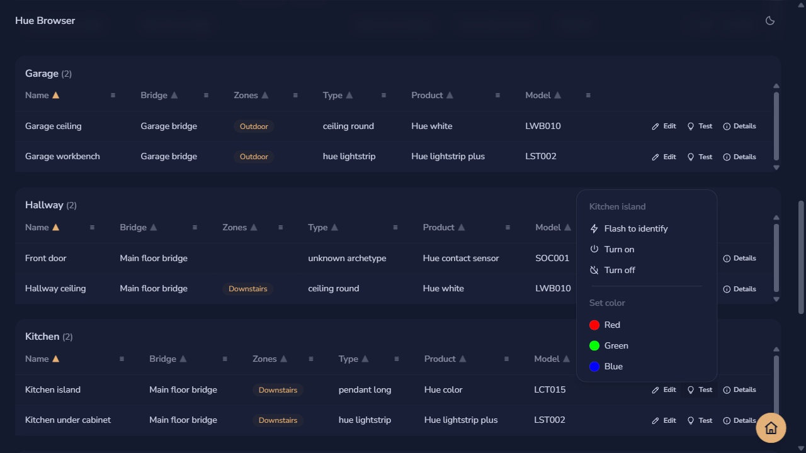

The dashboard lists physical devices from every bridge paired in this browser. Lights, switches, sensors, and other device types appear together in a spreadsheet-style table with columns for name, bridge, room or zone, type, product, and model. Devices are grouped by room and sorted A–Z by name until you change either setting.

## Sort and filter columns

Every column header carries its own sort and filter controls, so you can shape the table without leaving it.

1. Select a column name to sort by that column. Select it again to reverse the direction; the arrow beside the name shows the current order.
2. Select the menu button at the right of a column header to open its filter list, then select the values you want to keep.
3. Select **Clear this filter** in the menu to reset one column, or **Clear filters** above the table to reset the search box and every column at once.

Each filter menu lists only the values present in that group, so a room that contains two device types offers exactly those two choices. Filters apply across every group, and the count above the table shows how many devices remain visible.

## Group by room or zone

The toggle beside the search box controls how the table is divided, because rooms and zones describe different parts of a Philips Hue setup.

- **Rooms** groups devices by the room the bridge assigned, and shows a **Zones** column.
- **Zones** groups devices by zone, and shows a **Room** column instead. A device that belongs to several zones appears under each one.
- **Flat** turns grouping off and lists every device in a single table.

Room and zone values render as tags. Select a tag to switch to that grouping and scroll to the matching group. A blank cell means the bridge has not assigned that device to a room or zone; those devices are collected under an **Unassigned** group, which is also available as a filter value.

## Inspect a device

The table shows the fields you usually need, and hides the rest behind a details row so the columns stay readable.

Select the information button at the end of a row to expand its details, which list the device capabilities, MAC address, hardware version, software version, manufacturer, and device identifier. Select the button again to collapse the row.

## Identify and test a light

Large setups make it hard to tell which row belongs to which physical fixture, so every row carries a small set of controls for checking one device.

Select the actions button at the end of a row to open its menu, then choose an action.

- **Flash to identify** blinks the device so you can spot it in the room. It works for any device that supports the Hue identify action, including switches and sensors.
- **Turn on** and **Turn off** switch the device's light on or off.
- **Set color** sends one of six preset colors and turns the light on first, because a color set on a dark light shows nothing.

The menu only offers the controls the device supports. A device without a light service, such as a contact sensor, offers **Flash to identify** alone, and the color swatches appear only for lights that can show color. The button shows a spinner while a command is in flight, and a failed command reports its reason under the row.

These controls send a single command each and do not change scenes, schedules, or automations stored on the bridge.

## Edit one device

Renaming a device, moving it to another room, and changing which zones it belongs to all happen in one place, because a bridge stores those three fields on the same device.

In the **Rooms** and **Zones** groupings, select **Edit** at the end of a row to open the edit dialog.

1. Enter a **Name** of 32 characters or fewer. Philips Hue rejects longer names.
2. Choose a **Room**. A device belongs to at most one room; choose **Unassigned** to remove it from its current room.
3. Select the **Zones** the device belongs to. A device may belong to any number of zones, or none.
4. Select **Save changes** to send the edit, or **Cancel** to discard it.

Only devices with a light can join a zone, because Hue zones group light services rather than whole devices. For a switch or sensor, the zone list is disabled and the dialog explains why.

## Migrate a room or zone

When a whole room or zone needs to move, use the migration flow instead of opening each device. The flow previews the devices first, then applies the move one device at a time and reports the result for each device.

1. Select **Migrate devices** above the table.
2. Choose the bridge, whether you are moving a room or zone, the source group, and the destination. Choose the empty destination option to remove every member from the source without deleting the group.
3. Select **Preview** and review the exact devices that will move.
4. Select **Move devices** to apply the migration. Review the result list afterward, because a bridge cannot roll back earlier changes if a later device fails.

## Edit many devices in the flat view

The **Flat** grouping is the spreadsheet. It is built for data entry, so its name, room, and zone cells are always editable and nothing is sent to a bridge until you say so.

1. Switch to the **Flat** grouping using the button at the bottom right of the page.
2. Edit the **Name**, **Room**, and **Zones** cells directly in the table. Changes are held in the browser.
3. A marker appears beside every cell that differs from the bridge, and the count beside **Save changes** shows how many devices are waiting.
4. Select **Save changes** to send every pending device, or **Discard** to drop them all and return to the values on the bridge.

Editing a cell back to its original value clears its pending mark automatically. **Save changes** stays disabled while any pending name is empty or too long.

Devices are saved one at a time, and the bridge has no way to apply them as a single transaction. If one device fails, the devices saved before it keep their changes, and the failures are reported by name so you can retry them.

## Search and refresh

Search and refresh work across every paired bridge at once.

Use the search box to match a device name, product, model, room, zone, bridge, or capability. The dashboard loads devices when it opens and when you change paired bridges; select **Refresh** to pick up changes made elsewhere. While devices load, animated placeholder rows stand in for the table. If one bridge cannot be reached or rejects its application key, its error appears above the table while devices from other bridges remain visible. Check its network connection or pair it again if the key was revoked.

Pending edits in the flat view are kept when you refresh, so a refresh will not lose work in progress.
