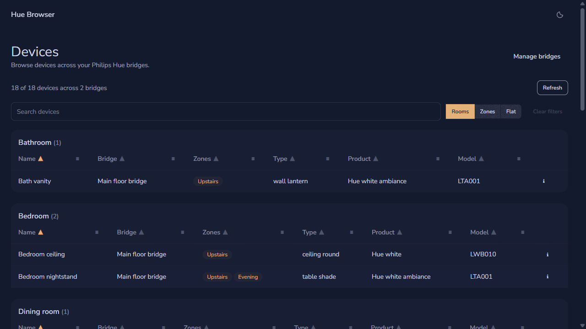
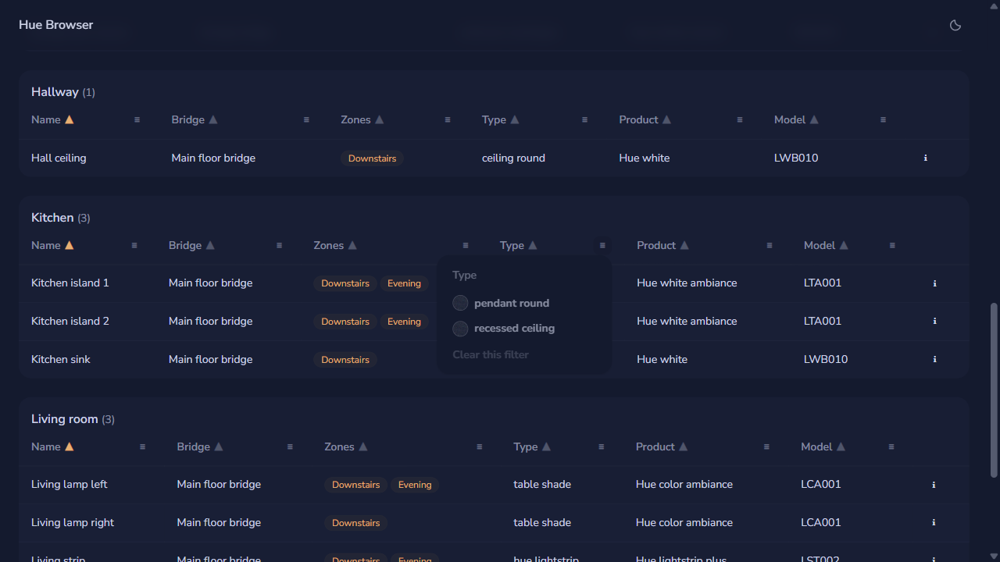
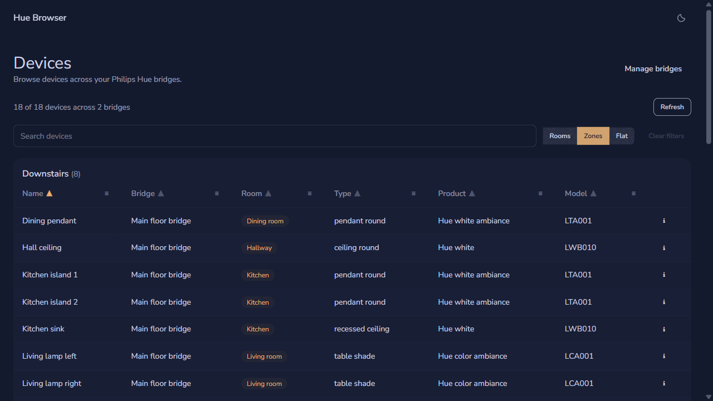
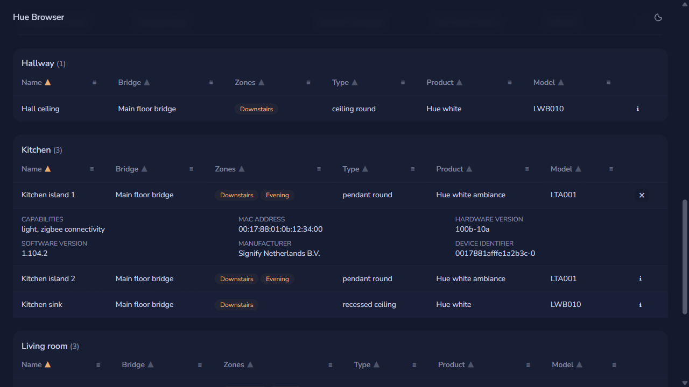

The dashboard lists physical devices from every bridge paired in this browser. Lights, switches, sensors, and other device types appear together in a spreadsheet-style table with columns for name, bridge, room or zone, type, product, and model. Devices are grouped by room and sorted A–Z by name until you change either setting.

## Sort and filter columns

Every column header carries its own sort and filter controls, so you can shape the table without leaving it.

1. Select a column name to sort by that column. Select it again to reverse the direction; the arrow beside the name shows the current order.
2. Select the menu button at the right of a column header to open its filter list, then select the values you want to keep.
3. Select **Clear this filter** in the menu to reset one column, or **Clear filters** above the table to reset the search box and every column at once.

Each filter menu lists only the values present in that group, so a room that contains two device types offers exactly those two choices. Filters apply across every group, and the count above the table shows how many devices remain visible.

## Group by room or zone

The toggle beside the search box controls how the table is divided, because rooms and zones describe different parts of a Philips Hue setup.

- **Rooms** groups devices by the room the bridge assigned, and shows a **Zones** column.
- **Zones** groups devices by zone, and shows a **Room** column instead. A device that belongs to several zones appears under each one.
- **Flat** turns grouping off and lists every device in a single table.

Room and zone values render as tags. Select a tag to switch to that grouping and scroll to the matching group. A blank cell means the bridge has not assigned that device to a room or zone; those devices are collected under an **Unassigned** group, which is also available as a filter value.

## Inspect a device

The table shows the fields you usually need, and hides the rest behind a details row so the columns stay readable.

Select the information button at the end of a row to expand its details, which list the device capabilities, MAC address, hardware version, software version, manufacturer, and device identifier. Select the button again to collapse the row.

## Search and refresh

Search and refresh work across every paired bridge at once.

Use the search box to match a device name, product, model, room, zone, bridge, or capability. The dashboard loads devices when it opens and when you change paired bridges; select **Refresh** to pick up changes made elsewhere. While devices load, animated placeholder rows stand in for the table. If one bridge cannot be reached or rejects its application key, its error appears above the table while devices from other bridges remain visible. Check its network connection or pair it again if the key was revoked.

This iteration is read-only: rename, room assignment, and identification controls will arrive in later iterations.
