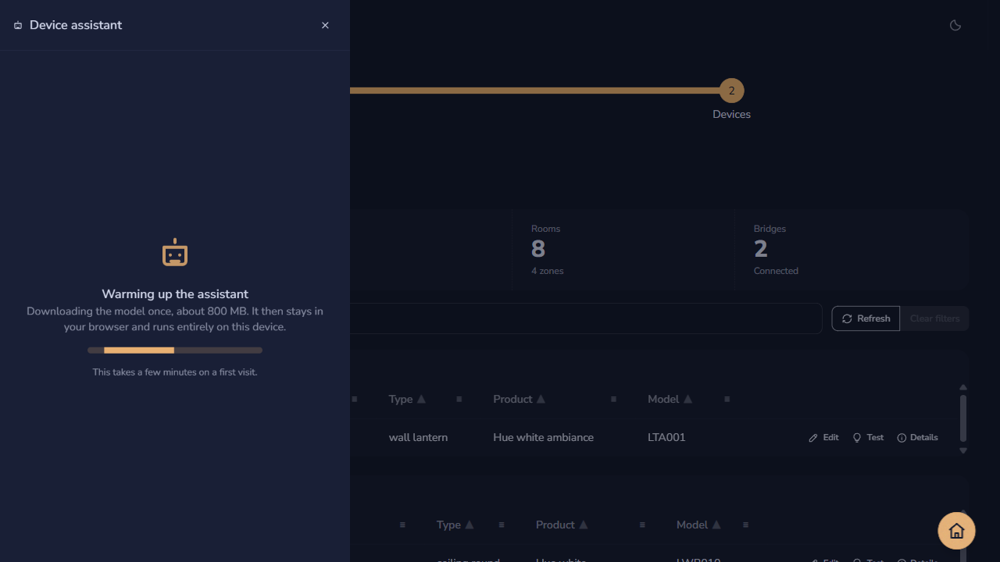
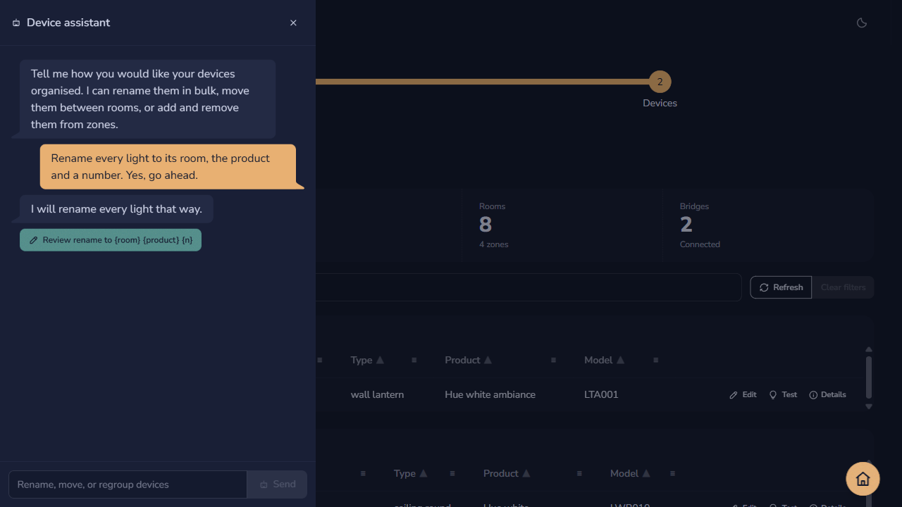
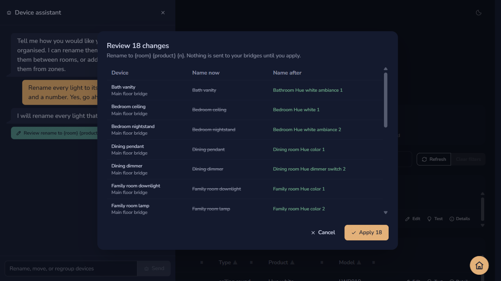

Renaming fifty lights one row at a time is slow, and it is easy to end up with three different naming schemes. The assistant is a small language model that runs inside your browser. You describe the scheme you want in plain language, it drafts a single change covering every device it applies to, and you review that change before anything reaches your bridges.

The assistant is optional. Everything else in Hue Browser works without it.

> [!NOTE]
> The assistant is a preview feature. It runs a small model, so it sometimes misreads a request or drafts a change wider than you asked for. Read the review dialog carefully before you apply anything, and report anything that looks wrong.

## Start the assistant

The assistant loads on demand, so you only pay for the download if you use it.

Select **Ask the assistant** to the left of the search box. The first time you open it, the app downloads the model, which is about 800 MB and takes a few minutes on a typical connection. A progress indicator runs while it downloads. After that first visit the model stays in your browser's storage and opens in a few seconds.

You need a browser with WebGPU, such as a current version of Chrome or Edge. If your browser does not support it, the drawer explains that instead of loading.

## Describe the change you want

The assistant knows how many devices you have and the names of your rooms and zones. It does not see anything else, and nothing you type leaves your computer.

Tell it what you want in ordinary words, for example:

- "Rename every light to its room, the product, and a number."
- "Only the kitchen ones, call them Counter and a number."
- "Move the devices with no room into the Hallway room."
- "Add all the lights to the Evening zone."

The assistant replies in the drawer and asks a question when it is not sure which devices you mean. Work out the scheme in conversation first; it only drafts a change once you agree to one.

## Review before anything is sent

When the assistant has a change it can make, it puts a **Review** button in the conversation. This is the only way a change reaches your bridges.

Select **Review** to open a table of every device the change affects, with the current value on the left and the proposed value on the right.

Read the list, then select **Apply** to send the changes or **Cancel** to throw them away and keep talking. Devices are sent one at a time, so if one fails the rest keep their new values and the failures are reported by name.

## What the assistant can and cannot do

The assistant is deliberately narrow. It drafts a small instruction, and ordinary code in the app works out what that instruction means for each device, so the model never writes out fifty individual changes and cannot invent a device that does not exist.

It can draft exactly one of these per change:

- Rename devices using a template
- Move devices that have no room into a room
- Add devices to a zone, or remove them from one

These limits apply to every change it drafts.

- **One field at a time.** It cannot rename devices and move them in the same change. Ask for the rename, apply it, then ask for the move.
- **Names must vary.** A rename template has to contain at least one token, so every device does not end up with the same name. The tokens are `{room}`, `{zone}`, `{product}`, `{type}`, `{bridge}`, `{model}`, `{name}`, and `{n}`. `{n}` counts up from 1 within each room.
- **Names are capped at 32 characters,** because Philips Hue rejects longer ones.
- **Only rooms and zones that already exist.** It cannot create a room or a zone. Create those on your bridge first, in the Philips Hue app.
- **Zones need a light.** A switch or a sensor cannot join a zone, because Hue zones group light services rather than whole devices, so those devices are skipped.
- **Moves only pick up unassigned devices.** When you ask for a room move without naming the devices to move, the draft is narrowed to the devices that have no room yet, because an unscoped move would re-file every device in the house. Moving a device that already sits in a room is a per-device edit in the flat view or the device dialog.
- **A change that changes nothing is refused.** If the draft would leave every device exactly as it is, the assistant says so and asks you to be more specific.
- **It never acts on its own.** Nothing is sent until you select **Apply** in the review dialog.

## A worked example

This is the most common way people use the assistant, and it shows the one-field-at-a-time limit in practice.

1. Open the assistant and ask it to rename everything to the room, the product, and a number.
2. Select **Review**, read the before and after columns, and select **Apply**.
3. Ask it to add the lights to a zone, for example "add all the lights to the Evening zone".
4. Select **Review** again, then **Apply**.

Each step is its own change with its own review, which keeps the before and after columns short enough to actually read.

## If the draft is wrong

The model is small enough to run on your own machine, which means it sometimes misreads a request.

If the review table is not what you expected, select **Cancel** and rephrase. Naming the room explicitly, or saying "every device" when you mean all of them, usually fixes it. Because the review always shows the exact result first, a misread draft costs you nothing but another sentence.
