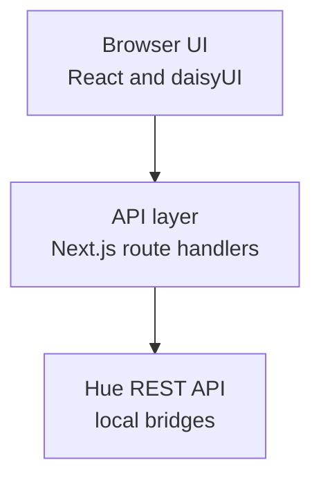

# Hue Browser

Hue Browser is a web application for managing large residential Philips Hue deployments. A home with dozens of lights accumulates a lot of structure: every light belongs to a room, carries a name, and sits behind one of potentially several bridges. Keeping that structure tidy is easiest when you can see all of it at once.

This project presents your whole deployment as an industrial-style dashboard. You can browse every device across every bridge, filter and group by room and device type, and make bulk edits such as renaming lights or reassigning them to rooms as straightforward data entry in a single table. It also offers basic identify and test controls, so you can flash a light or toggle it to confirm you are editing the fixture you think you are.

Hue Browser talks to bridges through the local [Hue REST API](https://github.com/openhue/openhue-api) and ships as a Docker container you can run on your own network.

## Prerequisites

You need the following installed before working on the project.

- Node.js 24 or later
- Docker, only if you want to build or run the container image

## Get started

Install dependencies and start the development server. The app rebuilds as you edit files.

```bash
npm ci
npm run dev
```

The app runs at <http://localhost:3000>.

## Commands

Each task has a dedicated npm script. Linting and formatting are handled by Biome, and type checking happens as part of the build.

| Command          | Description                                          |
| ---------------- | ---------------------------------------------------- |
| `npm run dev`    | Start the development server with hot reloading      |
| `npm run build`  | Create a production build and type check the project |
| `npm start`      | Serve a production build that was already created    |
| `npm run lint`   | Check formatting and lint rules without writing      |
| `npm run format` | Apply formatting and safe lint fixes                 |

## Docker

The container build produces a self-contained production image. The first command builds the image locally and the second runs it, publishing the app on port 3000 of your machine.

```bash
docker build -t hue-browser .
docker run --rm -p 3000:3000 hue-browser
```

## Stack

The application layers a React interface over an API layer that handles all bridge communication, which keeps device transformations independent of the interface that triggers them.



## Attribution

Hue Browser is built on the work of these projects.

| Project | Role |
| ------- | ---- |
| [Next.js](https://nextjs.org) | React framework, routing, and API layer |
| [React](https://react.dev) | User interface library |
| [TypeScript](https://www.typescriptlang.org) | Typed language for application code |
| [Tailwind CSS](https://tailwindcss.com) | Utility-first styling |
| [daisyUI](https://daisyui.com) | Component and theme layer for Tailwind CSS |
| [Biome](https://biomejs.dev) | Linting and formatting |
| [PostCSS](https://postcss.org) | CSS processing pipeline for Tailwind CSS |
| [Node.js](https://nodejs.org) | JavaScript runtime |
| [Docker](https://www.docker.com) | Container build and distribution |
| [OpenHue API](https://github.com/openhue/openhue-api) | OpenAPI specification for the Philips Hue REST API |

## License

Hue Browser is released under the MIT License.
