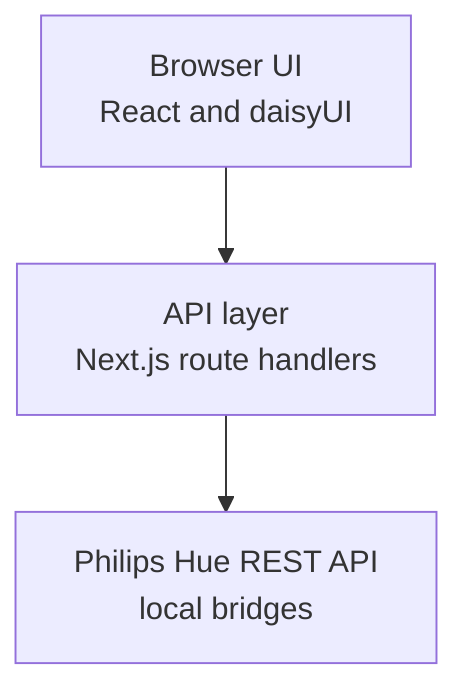

# Hue Browser

Hue Browser is a web application for managing large residential Philips Hue deployments. A home with dozens of lights accumulates a lot of structure: every light belongs to a room, carries a name, and sits behind one of potentially several bridges. Keeping that structure tidy is easiest when you can see all of it at once.

This project presents your whole deployment as an industrial-style dashboard. You can browse every device across every bridge, filter and group by room and device type, and make bulk edits such as renaming lights or reassigning them to rooms as straightforward data entry in a single table. It also offers basic identify and test controls, so you can flash a light or toggle it to confirm you are editing the fixture you think you are.

Hue Browser talks to bridges through the local [Philips Hue REST API](https://github.com/openhue/openhue-api) and ships as a Docker container you can run on your own network.

## Prerequisites

You need the following installed before working on the project.

- Node.js 24 or later
- Docker, only if you want to build or run the container image

## Get started

Install dependencies and start the development server. The app rebuilds as you edit files.

```bash
npm ci
npm run dev
```

The app runs at <http://localhost:3000>.

## Commands

Each task has a dedicated npm script. Linting and formatting are handled by Biome, type checking happens as part of the build, and the documentation site has its own set of commands.

| Command | Description |
| ------- | ----------- |
| `npm run dev` | Start the development server with hot reloading |
| `npm run build` | Create a production build and type check the project |
| `npm start` | Serve the standalone production build that was already created |
| `npm run lint` | Check formatting and lint rules without writing |
| `npm test` | Test bridge pairing and browser storage helpers |
| `npm run test:integration` | Build the app and run Playwright dashboard scenarios |
| `npm run format` | Apply formatting and safe lint fixes |
| `npm run docs:dev` | Start the documentation site with hot reloading |
| `npm run docs:build` | Build the documentation site into `dist` |
| `npm run docs:preview` | Serve the built documentation site with its published base path |

The Playwright integration suite uses the committed fixture at `tests/fixtures/bridge-devices.json`. Run `npm run test:integration` to reproduce the CI browser scenarios locally without a real Philips Hue bridge.

Use `npm run docs:preview` rather than serving `dist` directly. The documentation site is published to a project subpath, so its asset links only resolve when the preview server applies that same base path.

## Docker

Every commit on the default branch publishes a public image to the GitHub Container Registry, so you can run Hue Browser without building anything. The image supports both `linux/amd64` and `linux/arm64`, which covers a Raspberry Pi or an Apple Silicon Mac.

```bash
docker run --rm -p 3000:3000 ghcr.io/seesharprun/hue-browser:latest
```

To build the image from your own checkout instead, build it and then run it.

```bash
docker build -t hue-browser .
docker run --rm -p 3000:3000 hue-browser
```

Either way the app is available at <http://localhost:3000>. Use a different host port, such as `-p 3100:3000`, when port 3000 is already serving the development server.

## Connect to a bridge

Open the app and connect a Philips Hue bridge. Follow the [bridge connection guide](https://seesharprun.github.io/hue-browser/usage/connect-bridges) for both methods, physical button pairing, and what to expect afterward.

The [device browsing guide](https://seesharprun.github.io/hue-browser/usage/browse-devices) explains the dashboard, column sorting and filtering, room and zone grouping, and the identify and test controls on each row.

## Continuous integration and deployment

GitHub Actions workflows keep the project healthy and distribute it. All of them are defined under `.github/workflows`, with names spelled out in full so that continuous integration and continuous deployment are easy to tell apart.

| Workflow | Trigger | Purpose |
| -------- | ------- | ------- |
| `continuous-integration.yml` | Pull requests and pushes to `main` | Installs dependencies with `npm ci`, then lints, tests, builds, runs Playwright integration tests, and confirms the container image and documentation site still build |
| `continuous-deployment-container.yml` | Pushes to `main` | Publishes the multi-architecture image to the GitHub Container Registry as `latest` and as the commit SHA |
| `continuous-deployment-docs.yml` | Pushes to `main` | Builds the documentation site as an artifact, then deploys that artifact to GitHub Pages |

## Documentation

The full documentation site is written for people who want to run Hue Browser rather than work on it, so it focuses on installation and everyday use. It is published from the default branch to [GitHub Pages](https://seesharprun.github.io/hue-browser).

Documentation source lives in `docs` as Markdown, with images in `docs/media`. Run `npm run docs:dev` to work on it locally.

The application icon lives in `src/app/icon.svg`. The documentation commands and deployment copy it to Blume's public assets so both sites use the same favicon; restart an already running docs server to pick up the new icon.

## Stack

The application layers a React interface over an API layer that handles all bridge communication, which keeps device transformations independent of the interface that triggers them.



## Attribution

Hue Browser is built on the work of these projects.

| Project | Role |
| ------- | ---- |
| [Next.js](https://nextjs.org) | React framework, routing, and API layer |
| [React](https://react.dev) | User interface library |
| [TypeScript](https://www.typescriptlang.org) | Typed language for application code |
| [Playwright](https://playwright.dev) | Integration testing in a browser |
| [Tailwind CSS](https://tailwindcss.com) | Utility-first styling |
| [daisyUI](https://daisyui.com) | Component and theme layer for Tailwind CSS |
| [Biome](https://biomejs.dev) | Linting and formatting |
| [Blume](https://useblume.dev) | Documentation site generator |
| [PostCSS](https://postcss.org) | CSS processing pipeline for Tailwind CSS |
| [Node.js](https://nodejs.org) | JavaScript runtime |
| [Docker](https://www.docker.com) | Container build and distribution |
| [GitHub Actions](https://github.com/features/actions) | Continuous integration and container publishing |
| [OpenHue API](https://github.com/openhue/openhue-api) | OpenAPI specification for the Philips Hue REST API |

## License

Hue Browser is released under the MIT License.
